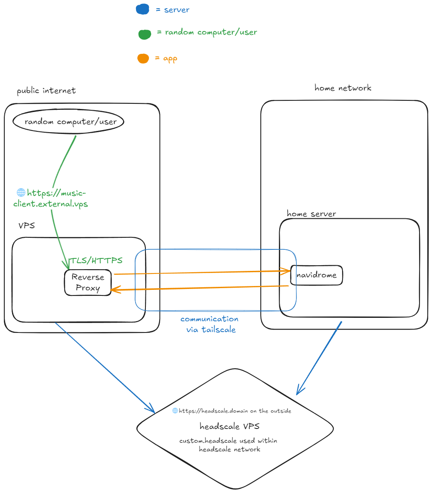

## Introduction
If you run Headscale, or are paranoid and severely distrust everyone, you're gonna be missing out on a fun feature of Tailscale, namely `tailscale funnel`. This allows for a service on your tailnet to be exposed to the internet, under a subdomain of your own `name.ts.net` domain. You also get a nice HTTPS certificate from Let's Encrypt for that domain. 

This process works by routing the app through Tailscale's servers and publicly exposing it through them. The specifics about how Funnel works is available on their [docs](https://tailscale.com/kb/1223/funnel).

Now this is nice and all, but what if you want to be more independent, or are running Headscale? Once you start running your own Tailscale coordination server using a service like Tailscale, you can't use Tailscale's servers to basically proxy your home services and expose them to the outside internet. However, you can start rolling out your own version of `tailscale funnel`. It's not as elegant as Tailscale's own implementation, but its still pretty capable. You do this by running your own VPS as a replacement for Tailscale's servers. 

## How it works
The way that this works is pretty simple. Your VPS and home server would both be connected to the same Headscale tailnet. You would have a service on your home server accessible that is accessible to that VPS. On the VPS, you would then reverse proxy that connection, making the service accessible under a nice domain and with HTTPS. You're getting a domain and HTTPS as the domain belongs to the VPS, and the VPS is also handling TLS via its own reverse proxy. 

